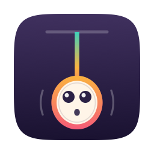
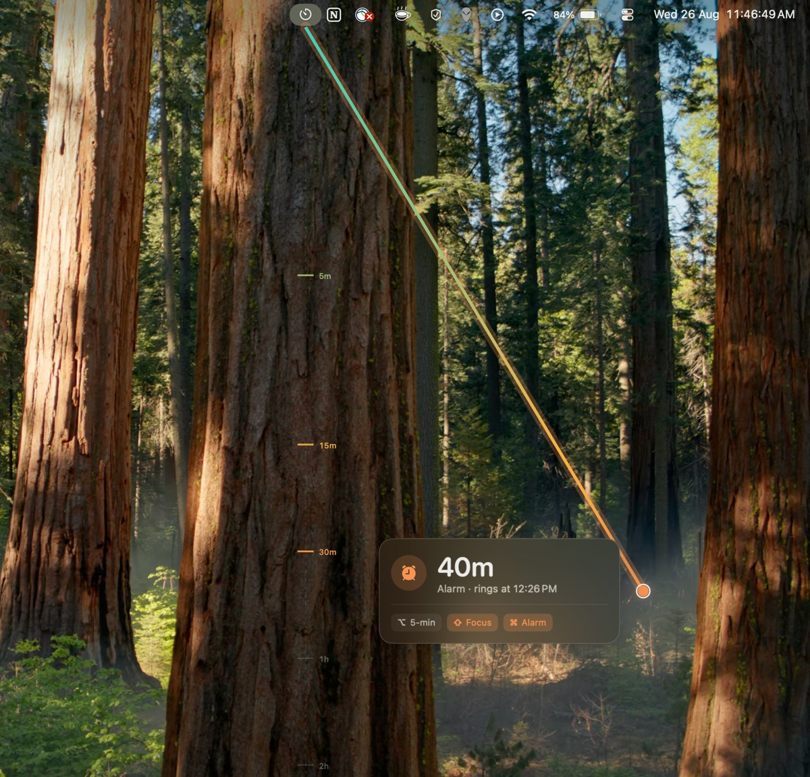
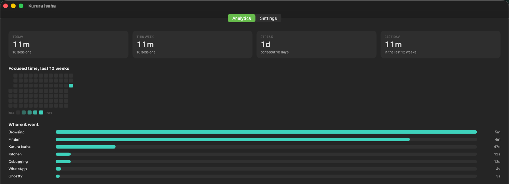

<div align="center">



# Kurura Isaha

**Pull a timer out of your menu bar.**

[](https://github.com/princechrix/kurura-isaha/actions/workflows/build.yml)
[](https://github.com/princechrix/kurura-isaha/releases/latest)
[](#install)
[](https://swift.org)
[](LICENSE)



</div>

---

A macOS menu bar timer with no timer field. Press the icon and drag downwards: a line
follows your cursor, a glass card reads out the duration your pull has reached, and letting
go starts it. Short pulls are minutes, long pulls are hours, and the whole range fits on one
screen.

`kurura isaha` is Kinyarwanda for *pull the clock*. The name is the interface.

## Why

Setting a fifteen minute timer should not involve a text field, a number pad, or a
dropdown. It is one gesture: reach up, pull down as far as feels right, let go. The pull
itself tells you what you are getting — a line that grows, ticks that light up as you pass
them, and a colour that warms as the minutes turn into hours.

## Features

- **Pull to set** — press the menu bar icon, drag down, release. Drag back up to cancel.
- **A scale that fits one screen** — logarithmic by default, so the top half of the display
  is spent on 1–15 minutes and the bottom half covers 15 minutes to 4 hours.
- **Modifier keys** — `⌥` snaps to five minutes, `⇧` binds a Focus mode, `⌘` turns the pull
  into a wall-clock alarm.
- **Reminders** — a card after release asks what the timer is for; whatever you type becomes
  the alert when time is up.
- **A real CLI** — `kurura 25m --note "check the deploy"` from any script or shell.
- **Automatic tagging** — sessions are named after the app you were in when you started.
- **Local analytics** — a twelve-week heatmap, a breakdown by tag, and CSV export.
- **Shell hooks and webhooks** — run something on start and on finish.
- **Sleep-proof** — timers are absolute end dates, so a sleeping Mac cannot lose time.
- **Multi-display and notch aware** — one overlay per screen, clamped to the safe area.
- **No dependencies** — SQLite comes from the SDK, the charts are hand-drawn, the icon is
  drawing code, and the argument parsing is fifty lines.

## Screenshots



## Install

### Download

Grab the latest `.app` from [Releases](https://github.com/princechrix/kurura-isaha/releases/latest),
unzip it, and move it to `/Applications`.

Builds are **ad-hoc signed**, not notarised, so Gatekeeper will object the first time.
Right-click the app and choose **Open**, or clear the quarantine flag:

```sh
xattr -dr com.apple.quarantine "/Applications/Kurura Isaha.app"
```

### Build from source

Requires Xcode 16 or newer.

```sh
git clone https://github.com/princechrix/kurura-isaha.git
cd kurura-isaha
./build.sh
open "dist/Kurura Isaha.app"
```

`build.sh` runs the tests, builds release, draws the icon, and assembles an ad-hoc-signed
bundle containing both the app and the `kurura` binary.

## Using it

### The pull

Press and hold the menu bar icon, drag down, release.

```
 ▔▔▔▔▔▔▔▔▔▔▔▔▔▔▔▔ menu bar ▔▔▔▔▔▔▔▔▔▔▔▔▔▔▔▔
        ●  ← anchor
        ┊ ── 5m
        ┃ ── 15m         ┌──────────────────────────┐
        ┃                │  ⏱  25m                  │
        ┃ ── 30m         │  Focus · ends at 14:45   │
        ●  ← cursor      │  ⌥ 5-min  ⇧ Focus  ⌘ Alarm │
        ┊ ── 1h          └──────────────────────────┘
        ┊ ── 2h
        ┊ ── 4h
```

The dashed rail shows how far the pull can still reach. Tick marks light up as you pass
them. The line is filled with a gradient sampled from the scale itself, so its colour at any
point is the colour of the duration that point represents — teal for minutes, amber around
the quarter hour, rose for the long haul. It doubles as the legend.

A plain click, with no drag, opens the menu.

### Modifiers

| Hold | Effect |
| --- | --- |
| `⌥` | Snap to 5-minute increments across the whole range |
| `⇧` | Bind this timer to your Focus mode |
| `⌘` | Set an alarm at a wall-clock time instead of a countdown |

### The scale

Logarithmic by default — a constant *ratio* per pixel rather than a constant number of
seconds. That is what lets one screen height cover 1 minute to 4 hours while leaving the
1–15 minute range, where precision actually matters, spread over half the display.

| Pull | Duration |
| --- | --- |
| 0% | 1m |
| 25% | 4m |
| 50% | 15m |
| 62% | 30m |
| 75% | 1h |
| 100% | 4h |

Rounding widens as the pull grows — whole minutes up to a quarter hour, then 5, 15 and 30
minute steps — so a three-hour pull does not shiver by single minutes under a resting hand.
Linear mode (a flat 10 pixels per minute) is available in Settings.

### After you let go

The timer starts the instant you release. A card then appears where you released it, asking
what it is for. Whatever you type becomes the alert when the time is up — the notification
reads *take the bread out* rather than *Deep Work done*.

It is a label, never a gate. `↩` saves it, `esc` leaves it, clicking away keeps what you
typed, and ignoring it entirely makes it disappear after eight seconds with the automatic
tag intact. The countdown is already running the whole time.

### The menu bar

Idle, the icon is the mark: a cord and a knob. Running, it becomes a countdown ring with the
remaining time beside it, coloured by how long the timer was. The menu lists everything
running with per-timer add, pause and cancel, plus fixed presets.

## The `kurura` command

The app opens a Unix domain socket; the CLI is a thin client that speaks one line of JSON to
it. Anything you can do by dragging you can do from a script.

```sh
kurura start --duration 25m --tag "Debugging"
kurura 25m --tag "Debugging"            # shorthand
kurura 10m --note "check the deploy"    # --note is what the pull card writes
kurura alarm --at 14:45
kurura status                           # or --json, for a status bar
kurura extend 5m
kurura pause / kurura resume
kurura cancel --all
kurura stats --days 7
kurura export --out ~/Desktop/focus.csv
```

`kurura start` launches the app if it is not already running. Exit codes: `0` success,
`1` refused, `3` app unreachable, `64` bad usage.

Install it from **Settings → Terminal → Install**, which symlinks the copy inside the app
bundle into `/usr/local/bin` when that is writable and `~/.local/bin` otherwise. It never
asks for an administrator password.

## Analytics

A twelve-week heatmap, a breakdown by tag, today/this week/streak/best-day figures, and CSV
export. Everything lives in one SQLite file at
`~/Library/Application Support/KururaIsaha/sessions.sqlite`. Nothing leaves the machine.

Sessions are tagged automatically from the app that was in front when you started — Xcode
and VS Code become *Coding*, Zoom becomes *Meeting*, and anything unrecognised keeps its own
name. `--tag` always wins over the guess.

**Tags and reminders are separate on purpose.** A tag groups sessions in the charts; a
reminder is one-off text for one timer. If the card you type *take the bread out* into wrote
that into the tag, the breakdown would fill with sentences nobody wants to group by. So the
reminder gets its own column: it names the timer in the menu, in `kurura status` and in the
alert, and it exports to CSV, while the chart still groups by *Kitchen*.

## Focus

Two features, easy to confuse.

**Focus sync** flips a macOS Focus mode alongside a timer. macOS has no public API for this,
so the app runs a Shortcut you build yourself: one that turns your Focus on, one that turns
it off. Name them in Settings. Hold `⇧` while pulling to bind a single timer without
enabling it globally.

**Strict Focus** pushes a blocked app back down when it comes to the front while a timer
runs, and makes you type a phrase to switch it off early.

## What macOS will and will not allow

Some of this cannot be built the way it sounds. Rather than shipping a convincing-looking
version, here is exactly where the line is.

| Feature | State |
| --- | --- |
| Pull gesture, scaling, snapping, modifiers | Working |
| Vector line, tick marks, colour ramp, glass HUD | Working |
| Reminder card after the pull | Working. Takes the keyboard via `.nonactivatingPanel`, so the app behind it stays active. |
| Haptics | Working, but only a Force Touch trackpad can feel them. A mouse gets an audible click instead. |
| Notifications with Add 5 / Dismiss | Working |
| Piercing an active Focus mode | Partial. The notification is marked `.timeSensitive`, but actually breaking through Focus needs an entitlement Apple grants on request. Without it the alert waits until Focus ends. |
| Terminal CLI, shell hooks, webhooks | Working. Hooks are off by default — they run arbitrary shell commands from a mouse gesture. |
| Auto-tagging by frontmost app | Working, by bundle identifier. Reading a browser's current URL would need Accessibility permission, which is too high a price for a nicer tag. |
| Focus / DND sync | Working via the Shortcuts CLI, because there is no public Focus API. |
| Strict Focus app blocking | **Partial.** It hides a blocked app when it activates. It is a speed bump, not a lock. Preventing a launch outright needs the Screen Time (`FamilyControls`) entitlement, granted by request. |
| Website blocking | **Not built.** Needs a root-owned helper editing `/etc/hosts` or a Network Extension content filter. Neither belongs in an ad-hoc-signed menu bar utility. |
| Survives quit, restart, sleep | Working. Timers are absolute end dates, so a sleeping Mac cannot lose time; the engine recomputes against the wall clock on wake and fires whatever came due. |
| Firing while the Mac is actually asleep | **Not possible here.** Scheduling a wake needs privileged power management. Instead the app holds an idle-sleep assertion while a timer runs, and catches up on wake if you close the lid anyway. |

App Store distribution is not viable for the power features — shell hooks, app hiding and
symlinking into `PATH` are all outside the sandbox. Direct distribution with a Developer ID
and notarisation is the intended route.

## Development

```sh
swift build      # debug
swift test       # 26 tests
./build.sh       # test, build release, draw the icon, assemble the bundle
```

To look at the icon without building the bundle:

```sh
swift build && "$(swift build --show-bin-path)/KururaIsaha" --render-icon /tmp/preview.iconset
```

### Layout

| Target | What is in it |
| --- | --- |
| `KururaCore` | Everything testable without a menu bar: the scaling curve, duration parsing, the control protocol and its client |
| `KururaIsaha` | The app — status item, gesture tracking, overlay, timer engine, storage, windows |
| `kurura` | The CLI |

The pieces worth knowing about:

- [`PullScale.swift`](Sources/KururaCore/PullScale.swift) — the curve, and the whole feel of the app, as one pure function
- [`StatusItemController.swift`](Sources/KururaIsaha/StatusItemController.swift) — the nested event loop that tracks the drag
- [`PullOverlayWindow.swift`](Sources/KururaIsaha/PullOverlayWindow.swift) / [`PullLineView.swift`](Sources/KururaIsaha/PullLineView.swift) — the click-through overlay and its drawing
- [`ReminderPrompt.swift`](Sources/KururaIsaha/ReminderPrompt.swift) — the card that asks what the timer is for, and the rules for going away
- [`TimerEngine.swift`](Sources/KururaIsaha/TimerEngine.swift) — absolute-end-date timers and everything that happens because one exists
- [`ControlServer.swift`](Sources/KururaIsaha/ControlServer.swift) — the socket the CLI talks to
- [`IconArtwork.swift`](Sources/KururaIsaha/IconArtwork.swift) — the app icon, as drawing code rather than a checked-in `.icns`

### Tests

26 tests over the scaling curve, duration parsing, and how a timer names itself: that a pull
never runs backwards, that half a screen is exactly fifteen minutes, that `⌥` really does
produce multiples of five, that the ceiling holds when you drag past the bottom of the
display, that a skipped reminder falls back to the tag, and that a session saved before the
reminder field existed still loads.

## Contributing

Issues and pull requests are welcome. Please run `swift test` before opening one, and keep
`VERSION` as the single source of truth for the version number — the bundle and the CLI both
read it back out of the built `Info.plist`, and CI checks that a `v*` tag matches it.

## License

[MIT](LICENSE)
